# Cognos Analytics 11.0.6 Mapping for Australia

Cognos Analytics 11.0.6 introduces Pitney Bowes Admin Boundary Polygons over the top of the MapBox base map. According to the [Cognos Analytics Release 11.0.6 is here! post on the Cognos Analytics blog](https://www.ibm.com/communities/analytics/cognos-analytics-blog/the-latest-release-of-cognos-analytics-is-here/), IBM was "able to significantly enhance the mapping capabilities by increasing the resolution of the postal code/area code level and expanding support for up to five levels of administrative boundaries."

## **What does this actually mean for Australia?**

In this post I hope to answer this question by providing notes about each level that I found.

### Postcodes
Most Australian Postcodes are supported with the exception of Northern Territory (won't map 3 digit postcodes). Pitney Bowes must maintain there own list of postcodes and the boundaries or retrieve them from Australia Post.  Unfortunately Australia Post require a fee to get the list of Postcodes in csv format hence in the animation below I have mapped with the [Australia Statistical Geography Standard 2016 Postal Areas](http://www.abs.gov.au/ausstats/abs@.nsf/Lookup/by%20Subject/1270.0.55.003~July%202016~Main%20Features~Postal%20Areas%20\(POA\)~8) with the addition of the following postcodes defined as Postal Areas:
* 4471
* 4857
* 2624
* 4219
* 4813

**Things to note:**
1. The data type of the postcode must be a string. Convert a number using the expression: cast(<number> as varchar(4))
1. Use "Australia" (or "AU") as the Refine Region
1. Postcode Data becomes out of date quickly

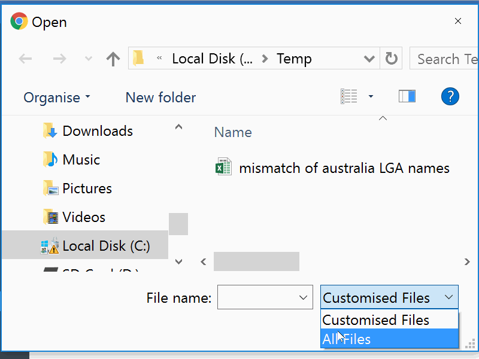

The Map widget supports zooming. Here is an example of the 2015 Drug Offences by NSW Postcodes zoomed into Sydney.

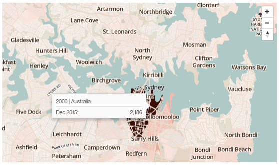

Created from the [BOSCAR Recorded crime postcode dataset](http://www.bocsar.nsw.gov.au/Documents/RCS-Annual/PostcodeData2015.zipx)

### Local Government Area (LGA)
Most Local Government Areas as defined in the [Australia Statistical Geography Standard 2014 Edition](http://www.abs.gov.au/AUSSTATS/abs@.nsf/DetailsPage/1270.0.55.003July%202014?OpenDocument) are supported. Below I have mapped the Local Government Areas in an animation. The following LGA Areas are missing:
* No usual address (NSW)
* No usual address (Vic.)
* Unincorporated Qld
* No usual address (Qld)
* No usual address (SA)
* Unincorporated WA
* No usual address (WA)
* Unincorporated Tas
* No usual address (Tas.)
* No usual address (NT)
* No usual address (ACT)
* No usual address (OT)

**Things to note:**
1. Íf the LGA Name contains two names seperated by a slash "/" (e.g. Waratah/Wynyard) then use one of the names (e.g. Waratah or Wynyard)
1. The LGA Status Suffix is not required - e.g. Brisbane can be used instead of Brisbane (C)
1. Use State as a Refine Region as there are two different LGAs called Campbelltown (one in New South Wales and the other in South Australia)
1. ACT uses "Unincorporated ACT" as there are no LGAs
1. The LGA Boundaries are already out of date and don't include the 2016 NSW Council amalgamations

As per the post code example here is the 2015 Drug Offences by NSW LGA zoomed into Sydney.

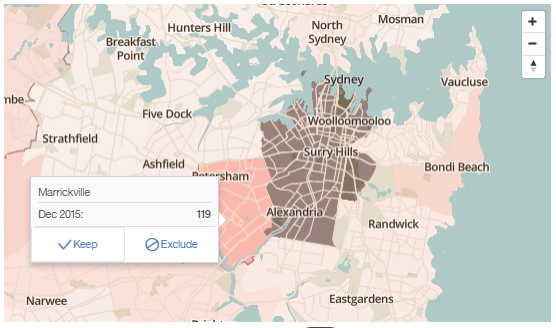

Created from the [BOSCAR Recorded crime LGA dataset](http://www.bocsar.nsw.gov.au/Documents/RCI_offencebymonth.zip)

### State Level
All of the Australian States are supported. Below I have mapped the Local Government Areas in an animation.

**Things to note:**
1. Include the dots if using the abbreviated version of the state name - e.g. A.C.T. not ACT
1. [Jervis Bay Territory](https://en.wikipedia.org/wiki/Jervis_Bay_Territory) is part of the Other Territories - in the Legacy Map (and 11.0.5) it is a defined region. (see below)
1. [Macquarie Island](https://en.wikipedia.org/wiki/Macquarie_Island) is not defined - in the Legacy Map (and 11.0.5) it is a defined region. (see below)
1. Use "Australia" as a Refine Region if required.
1. Use the Point option if including Jervis Bay Territory in the analysis due to the size of Australia. The Region option is fine if comparing South East New South Wales. (see below)

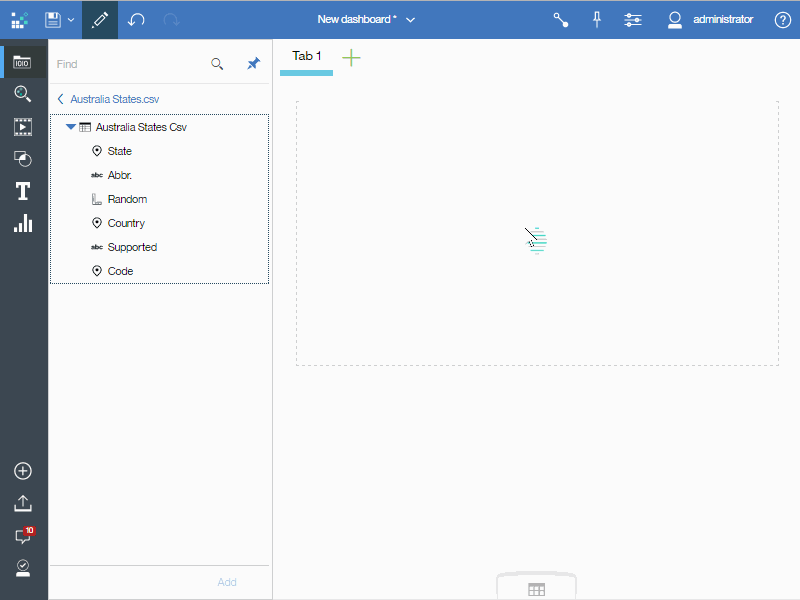

Jervis Bay Territory as "Other Territories" and zoomed

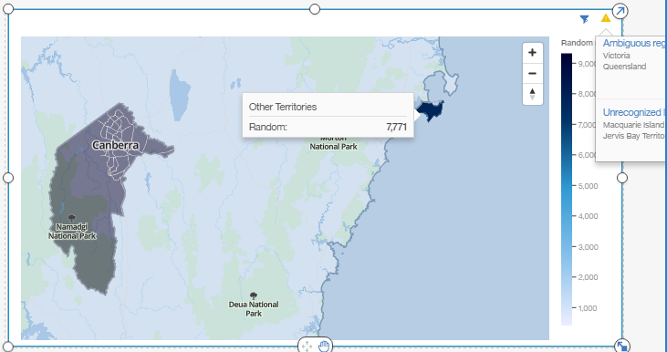

Jervis Bay Territory using the Legacy Map

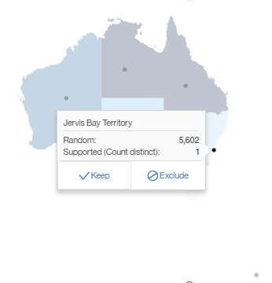

Macquaire Island using the Legacy Map

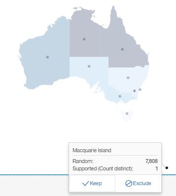

### Country Level
Australia, Cocos Island, Christmas Island, Norfolk Island and Heard Island and McDonald Islands are supported.

**Things to note:**
1. Use "Australia and New Zealand" as a Refine Region if required except Heard Island and McDonald Islands which use "Antartica" as a Refine Region (see below)
1. [ISO 3166-1 Alpha Codes](https://en.wikipedia.org/wiki/ISO_3166-1_alpha-2) can be used as an abbreviated form of the Country Name
1. Use the Point option if comparing Australia with the External Territories because of the size of Australia. (see below)

Australia Map using Points to show all Countries

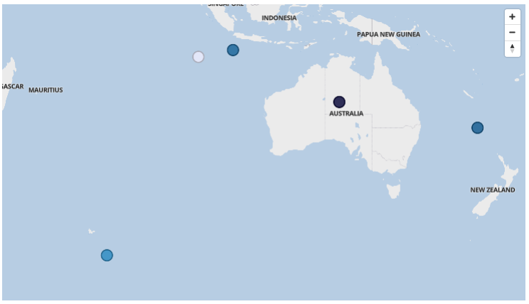

Christmas Island zoomed in

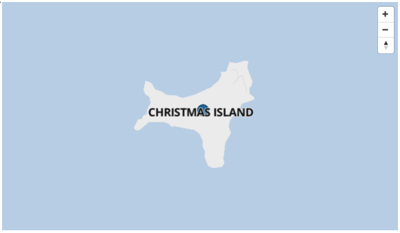

Cocos Island zoomed in

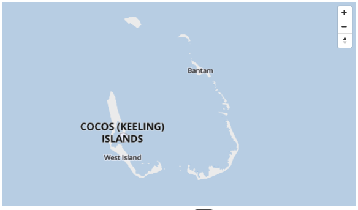

Heard Island zoomed in

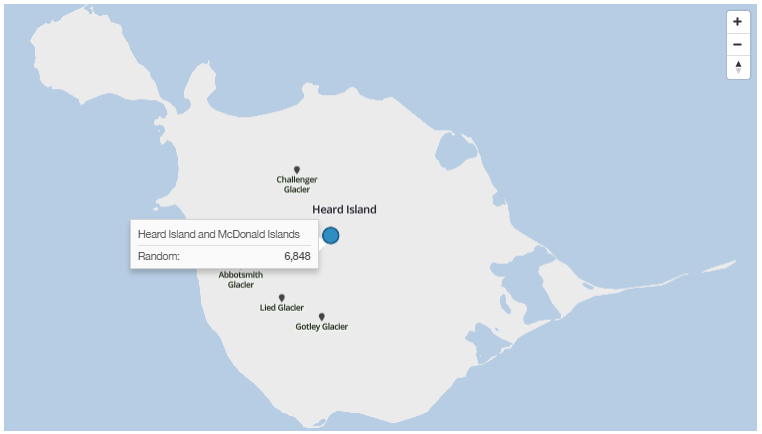

Norfolk Island zoomed in

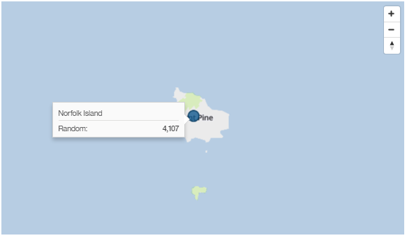

Norfolk Island point on Legacy Map

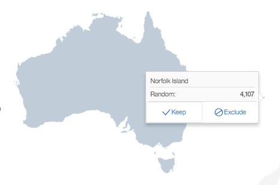

### **What's next?**

"Custom Features" which is the ability to show your own polygons on the base maps.  This would extend the capability to show Suburbs, Statistical Regions or other Points of Interest including Airports, Streets or even a Route between two points.

Can't wait for [Custom Features](https://www.ibm.com/communities/analytics/cognos-analytics-blog/cognos-analytics-11-0-5-mapping-and-visualization-faq/) Support.

For more information on the Mapping Enhancements: [Cognos Analytics Mapping enhancements in 11.0.6](https://www.ibm.com/communities/analytics/cognos-analytics-blog/cognos-analytics-mapping-enhancements-in-11-0-6/)

